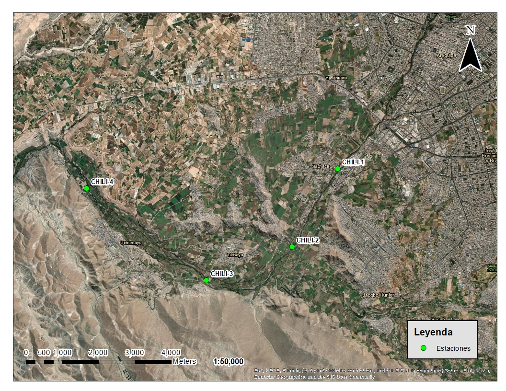

# Modelo Predictivo de Calidad de Agua basado en Deep Learning – Río Chili

Este repositorio contiene el desarrollo de un modelo predictivo aplicado a la calidad de agua del río Chili, empleando una red neuronal prealimentada (MLP). El proyecto integra ciencia ambiental, análisis de datos y aprendizaje profundo para demostrar cómo la inteligencia artificial puede apoyar la gestión hídrica y la toma de decisiones.

---

## 1. Motivación y contexto ambiental

El río Chili es un cuerpo de agua fundamental para la región de Arequipa, debido a su uso en abastecimiento poblacional, riego agrícola, ganadería y actividades económicas. Sin embargo, estudios han evidenciado su deterioro por vertimientos domésticos, industriales y cargas urbanas, observándose variaciones en parámetros como DBO, DQO, coliformes y metales pesados.

Este proyecto plantea un enfoque innovador: construir un modelo capaz de aprender de datos históricos y, con ello, predecir condiciones futuras de la calidad del agua para apoyar decisiones ambientales.

---

## 2. Objetivo del proyecto

Desarrollar un pipeline completo que pueda:

1. Cargar y procesar una base de monitoreo hídrico
2. Ejecutar un análisis exploratorio (EDA) para comprender la data
3. Entrenar una red neuronal prealimentada (MLP)
4. Optimizar y validar el modelo mediante métricas cuantitativas
5. Guardar el modelo para reutilizarlo en escenarios reales
6. Permitir el envío de nueva data para obtener predicciones futuras automáticamente


---

## 3. Estructura del repositorio

```

PROYECTO_FINAL/
├── imgs/                       # imagen del mapa del área de estudio
├── 01_EDA.ipynb                # análisis exploratorio
├── 02_modelo_mlp.ipynb         # entrenamiento del modelo
├── modelo_calidad_agua.h5      # modelo final guardado
├── scaler_features.pkl         # scaler usado para procesar variables
├── predictor.py                # script para ejecutar una predicción en terminal
├── BBDD_FINAL_sintetica.csv    # dataset sintético (base de monitoreo)
└── README.md
```
---

## 4. Análisis exploratorio – EDA

El notebook `01_EDA.ipynb` desarrolla:

- Estadísticos descriptivos
- Histogramas y boxplots
- Análisis por estación, temporada y año
- Matriz de correlación entre variables fisicoquímicas y biológicas
- Interpretación de comportamiento ambiental

---

## 5. Construcción del modelo – Red Neuronal MLP

El modelo se implementa con TensorFlow/Keras con la siguiente arquitectura:

    model = Sequential([
        Dense(32, activation='relu', input_shape=(X_train.shape[1],)),
        Dense(16, activation='relu'),
        Dense(1)
    ])

---

### Configuración de entrenamiento
- Modelo: Red MLP (Dense → Dense → Dense 1)
- Optimizador: Adam (LR = 0.001)  
- Función de pérdida: MSE  
- Métrica: MSE / MAE  
- Validación: 80% / 20%  
- EarlyStopping para evitar sobreentrenamiento  
- Dataset procesado eliminando columnas no numéricas (station, year, season)


## 6. Optimización, guardado y nueva data

### Optimización y resultados

Se ajustaron redes neuronales para el tamaño de batch y número de épocas.  
El modelo se detuvo automáticamente cuando no mejoraba, evitando overfitting.

Resultados estimados:

    MSE = 0.0231
    MAE = 0.1214

---

### Guardado y reutilización del modelo

    from tensorflow.keras.models import load_model
    model = load_model("models/modelo_calidad_agua.h5")
    pred = model.predict(nueva_data)

---

### Como predecir

```

Desde la terminal (con el ambiente virtual activado):

python predictor.py

Ejemplo:

Variables usadas por el modelo:
['DBO', 'DQO', 'TDS', 'arsenico', ..., 'zinc']

Predicción para esa fila:
7.639373

```

---


## 7. Conclusión

Este proyecto demuestra:

✔ La aplicabilidad de deep learning en calidad ambiental  
✔ La posibilidad de anticipar condiciones futuras del agua  
✔ Potencial para uso institucional (ANA, SENACE, OEFA, EPS, consultoras)  
✔ Relevancia para optimizar monitoreos y priorizar estaciones críticas  


---

## Declaración sobre la base de datos sintética (para coherencia ambiental)

Este proyecto no utiliza datos de monitoreo reales. La base empleada es **sintética**, generada con fines académicos para probar técnicas de machine learning y deep learning.  
Las mediciones no representan condiciones reales del río Chili.

**Metodología de generación de la data** :
- Se tomaron filas reales de la base original como referencia y se seleccionaron mediante muestreo con reemplazo.
- Se rellenaron valores nulos utilizando la media para cada variable y así garantizar cálculos estadísticos consistentes.
- Se calculó la desviación estándar por variable y se añadió un ruido gaussiano suave (±10% σ) para crear variación.
- Se limitaron valores para que:
  - No existan valores negativos cuando la variable original no podía ser negativa.
  - Se mantengan dentro del rango observado ± 3σ.
- Columnas categóricas (**station, season, year**) se conservaron desde las filas base reales para mantener proporciones y estructura ambiental del río.

**Advertencia**  
Esta base es artificial y fue utilizada únicamente para exploración y experimentación. No debe interpretarse como una medición de campo ni evidencia ambiental.

---

## Instalación del entorno

Se recomienda crear un entorno virtual: unalm_ia

Instalar dependencias: 
pip install -r requirements.txt


---

## 🌍 Contexto del área de estudio

El área de estudio considera **4 estaciones de monitoreo a lo largo del río Chili**: CHILI-1, CHILI-2, CHILI-3 y CHILI-4, ubicadas entre la salida de Arequipa, valle de Socabaya y zona de Huayco.  
En dichas estaciones se monitorean parámetros fisicoquímicos, microbiológicos, metales en sedimento y diversidad hidrobiológica.  
El río Chili está influenciado principalmente por:
- Vertimiento de aguas servidas
- Actividades agrícolas y ganaderas
- Actividades industriales en la zona del Parque Industrial Río Seco
- Regulación del caudal por el embalse Aguada Blanca

Se diferenció estacionalmente la información entre:
- **Estación húmeda:** enero – marzo
- **Estación seca:** abril – diciembre

Este contexto permite darle coherencia al dataset sintético y a su uso dentro de un flujo de modelamiento predictivo ambiental.

<p align="center">  </p>


## ✉️ Contacto

📧 ginoiglp@gmail.com
🐙 [GitHub (/ginoiglp)]

